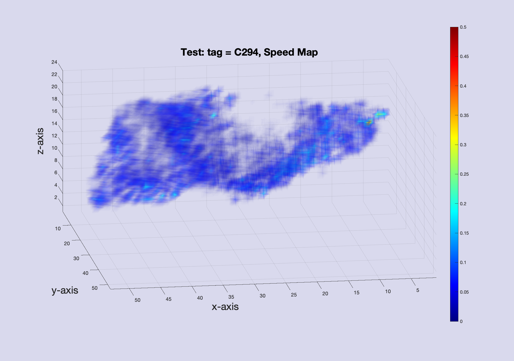
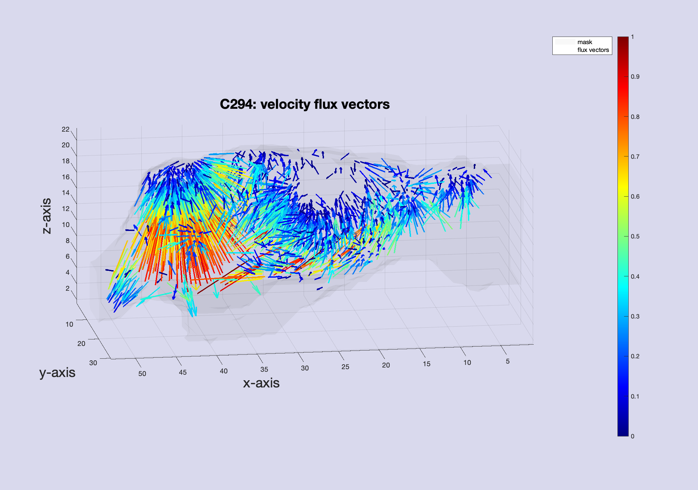

# rOMT_spdup
This repository contains the modified version of the rOMT algorithm part in rOMT repository.  
We speed up the original algorithm and include the version of handling 2D data.  
Go to Inverse -> GNblock_u.m for editing history 

# Sample case for demonstration
Run ``driver_CAA.m`` which contains a sample data case with default paramters. This is a healthy rat brain DCE-MRI data. It takes about 7 minutes to run on a local computer with i7 and 16G memory while the original version before improvement took about 70 minutes. 

The results of Lagrangian Speed Map (without QuickBundle) and Velocity Flux Vectors will pop up automatically, both ran and visualized in Matlab_R2019b. 

For more info about the theory and details about the project, please go to https://github.com/xinan-nancy-chen/rOMT
